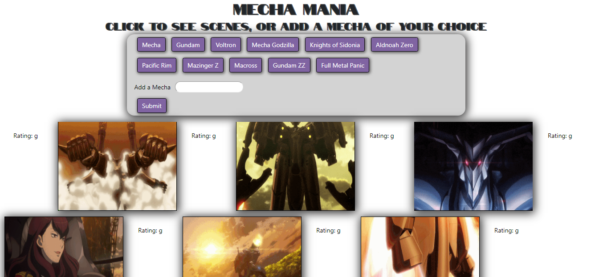

# GIFtastic
Simple and fun page that populates the page with fun gifs and allows the user to create buttons that will grab gifs of the subject they choose.
 
## Overview

In this assignment I used the GIPHY API to make a dynamic web page that populates with gifs. To finish this task, I called the GIPHY API and used JavaScript and jQuery to change the HTML of your site.

 

 [Link to application](https://cpaul319.github.io/GIFtastic/)

